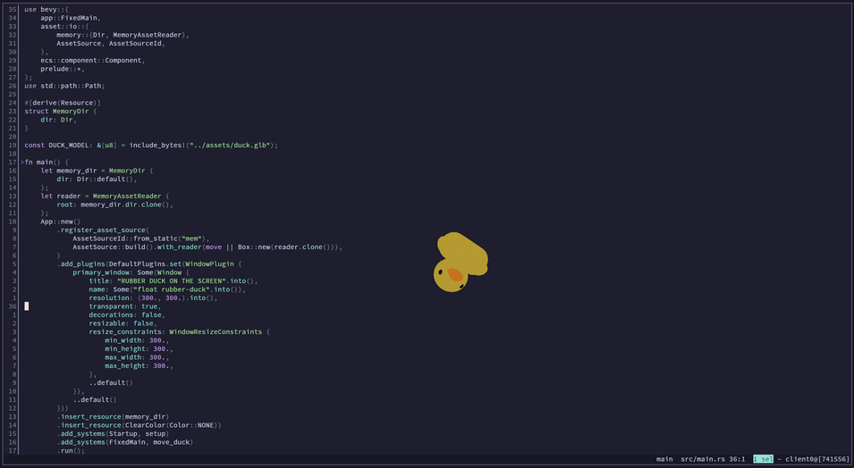
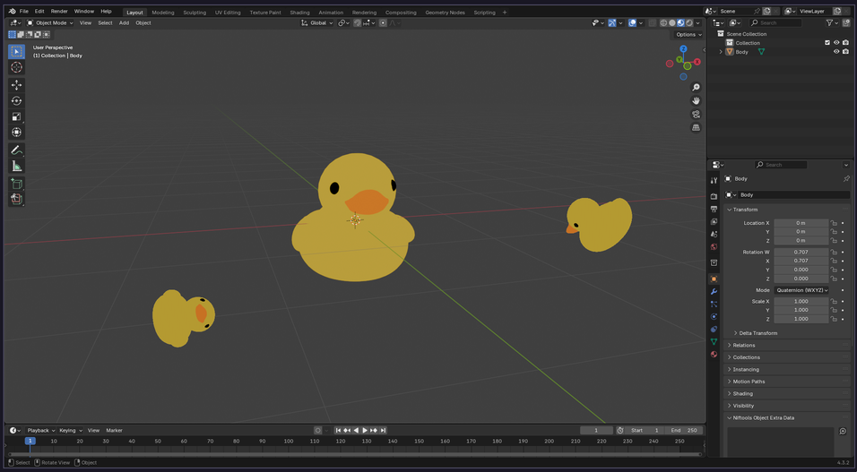
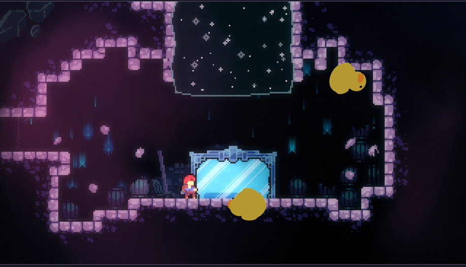

<small>i heard the term "rubber duck debugging" once and made this</small>

# RUBBER DUCK ON THE SCREEN

*it's a rubber duck, on the screen!*

## BUILDING & INSTALLING

you need rust and git installed

windows and macos r untested

- Clone the repo: `git clone https://github.com/TooManyChoices/rubber-duck-on-the-screen.git`
- go into the directory
- Build `cargo build --release` (this uses bevy so it will take a bit)
- Install `cargo install --path .`

use it and become a 10x engineer!

great with modeling!

real good at gaming!

oh no

